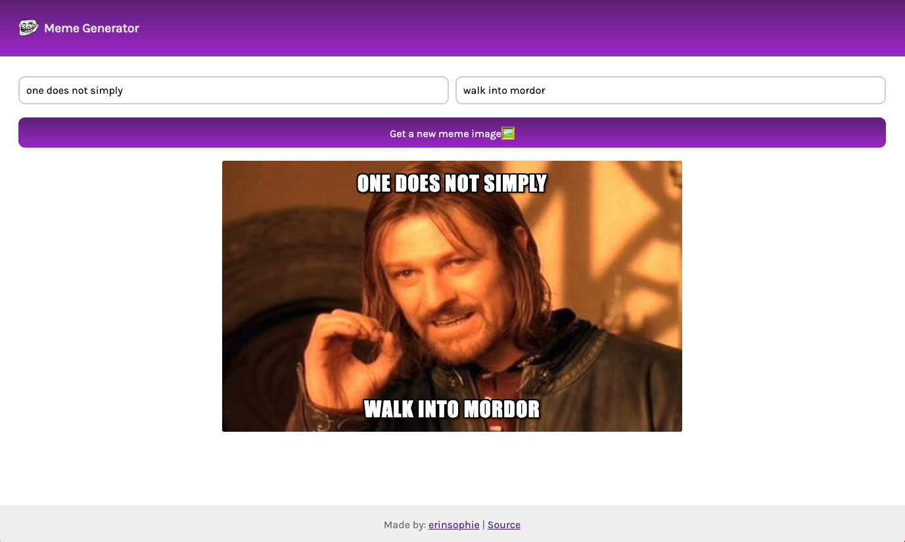

# Meme generator

## [Live Demo](https://erinsophie.github.io/meme-generator/)

# Technologies Used

- HTML
- CSS
- Javascript
- React

# Project goals

The main goal of this project was to learn about state in React. By making a fetch request to an API, it returns a set of memes which can be used to randomly generate a new image upon clicking the button while adding whatever text you like on top!
